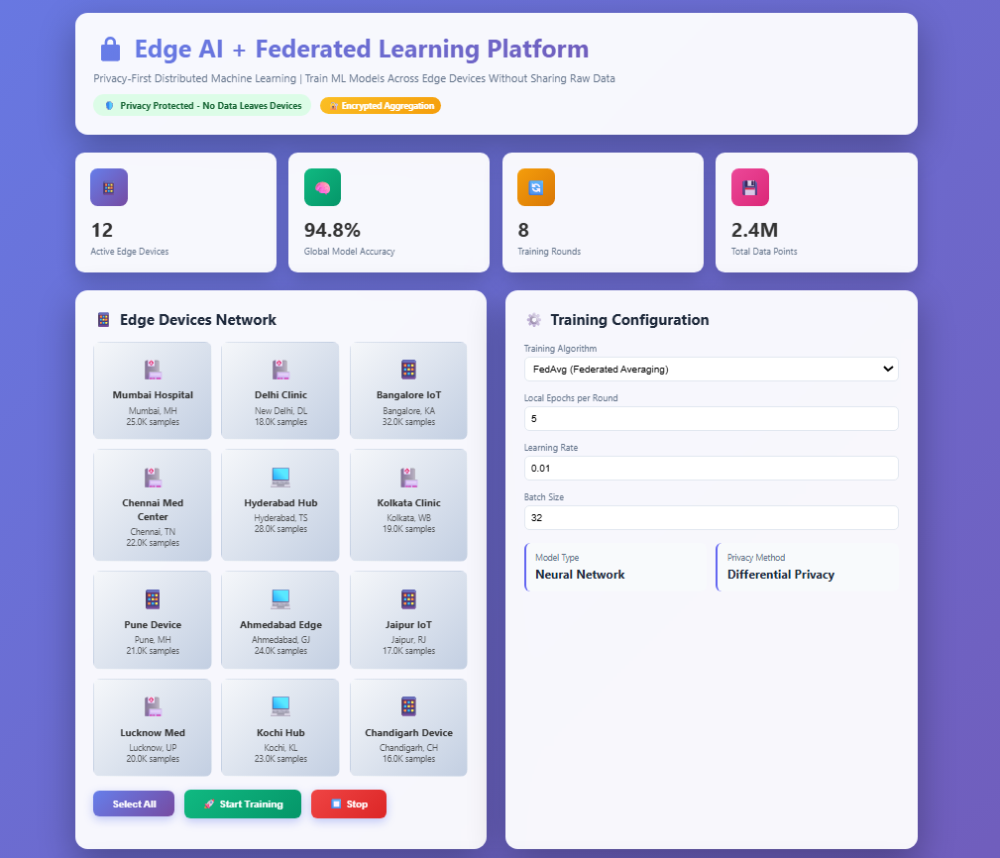
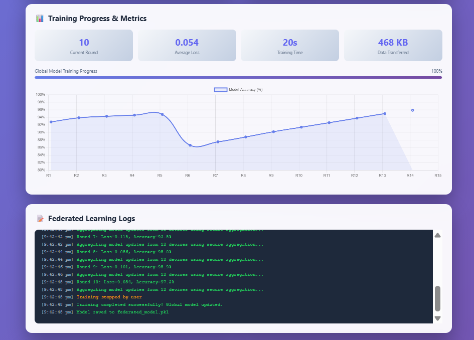

# Edge AI + Federated Learning Web Application

## Overview

This project is a complete, interactive web application demonstrating Edge AI combined with Federated Learning to train ML models across multiple edge devices without sharing raw data — ensuring privacy-first AI. 

---

---

## Features

- Simulates federated learning across 12 Indian edge devices
- Privacy-first: no raw data leaves edge devices
- Real-time dashboard with accuracy, loss charts, and logs
- Configurable training epochs, batch size, learning rate
- Smooth animations and modern UI effects
- Model loading and interaction via pickle file on the backend
- Demonstrates differential privacy and secure aggregation concepts

